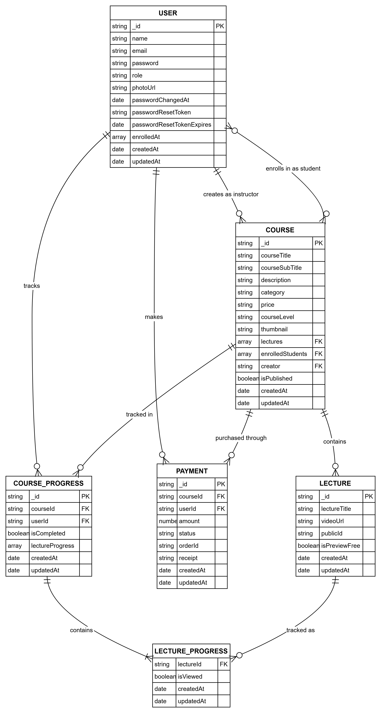
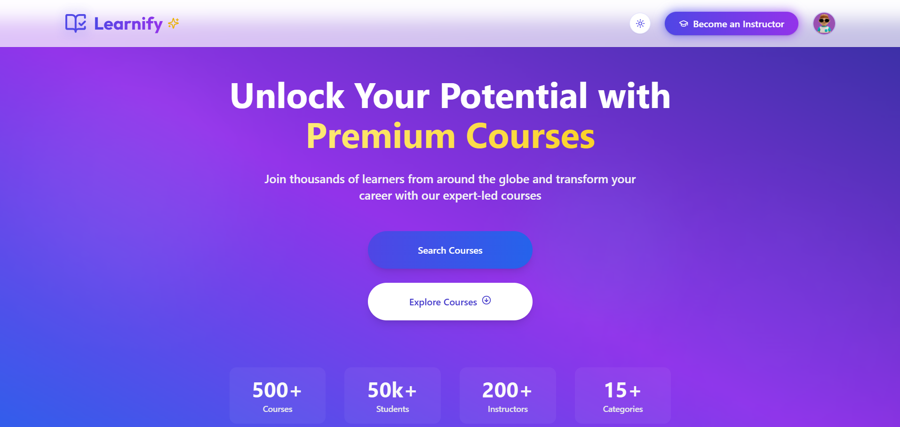
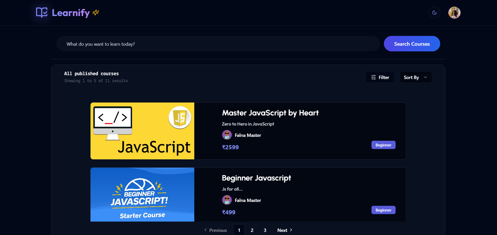
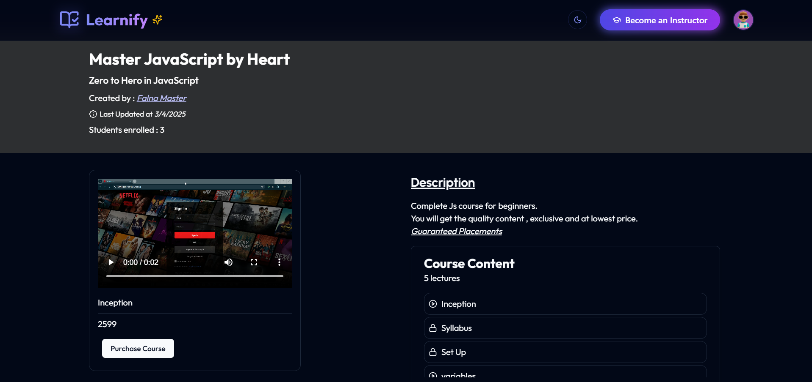
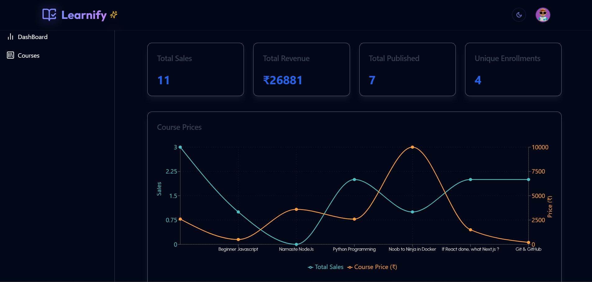
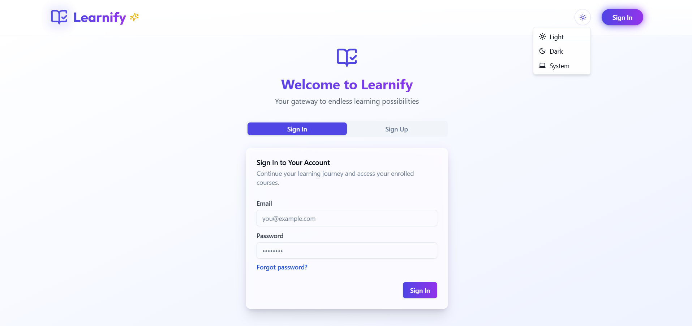
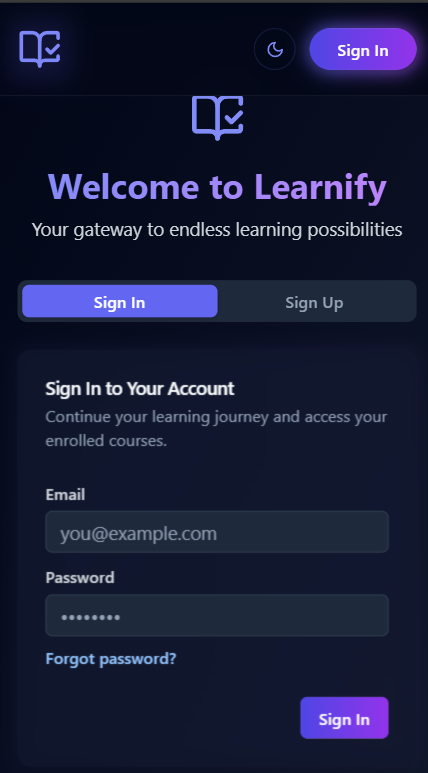
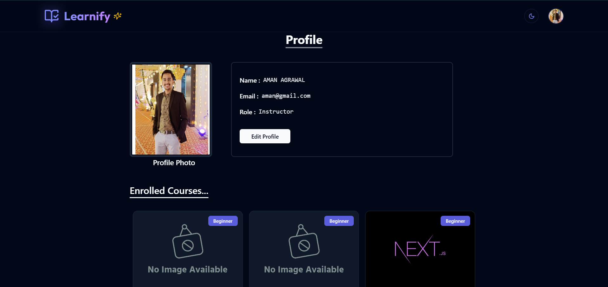
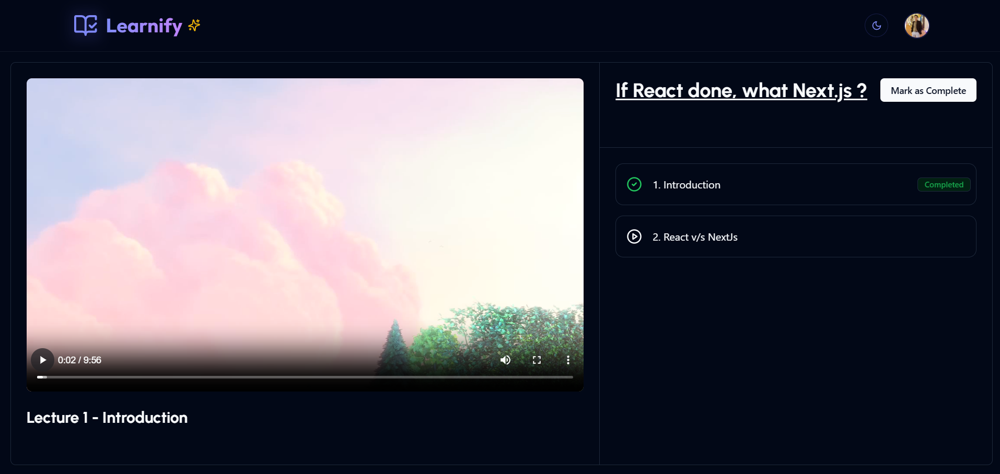
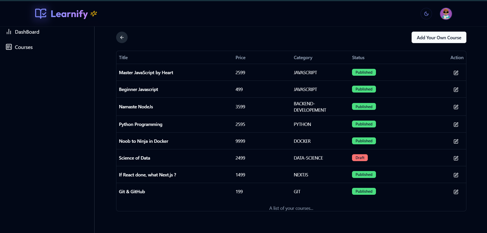

# Learnify: A Learning Management System
<!-- 
 
-->

## Table of Contents
- [Introduction](#introduction)
- [Features](#features)
- [Technology Stack](#technology-stack)
- [Architecture & Data Flow](#architecture)
- [Entity Relationships (ER Diagram)](#entity-relationships)
- [API Documentation](#api-documentation)
- [Directory Structure](#directory-structure)
- [Environment Variables](#environment-variables)
- [Glimpse of UI](#glimpse-of-ui)
- [Contributing](#contributing)

## Introduction

Learnify is a comprehensive Learning Management System (LMS) designed to provide an intuitive platform for online education. It enables instructors to create and manage courses while allowing students to enroll and engage with course content. The platform includes features such as course creation, video lectures, payment integration, progress tracking, and a responsive UI with dark/light mode support.

- [Client Documentation](./client/README.md)
- [Server Documentation](./server/README.md)

## Features

### Student Features
- Browse available courses with detailed descriptions
- Search functionality with suggestions
- Purchase courses via Razorpay payment integration
- Track learning progress for enrolled courses
- Mark courses as complete/incomplete
- Responsive video player for course lectures
- Profile management

### Instructor Features
- Create and publish courses with rich text descriptions
- Upload video lectures with preview options
- Edit course details and content
- Remove course
- Dashboard with sales analytics and statistics
- Course management tools
<!-- 
### Administrative Features
- User management
- Course analytics dashboard
- Statistical insights for revenue tracking -->

### System Features
- JWT-based authentication
- Role-based access controls
- Responsive UI with dark/light mode
- Email notifications for password reset

### `Wait for exciting features in future updates...`

## Technology Stack

### Frontend
- **Framework**: React with Vite
- **State Management**: Redux Toolkit with RTK Query
- **Styling**: Tailwind CSS with shadcn/ui components
- **Animations**: Framer Motion
- **Rich Text Editing**: React Quill
- **Media**: React Player for video content
- **Chart**: Rechart

### Backend
- **Runtime**: Node.js
- **Framework**: Express.js
- **Database**: MongoDB with Mongoose ODM
- **Authentication**: JWT (JSON Web Tokens)
- **Validation**: Validator
- **File Upload**: Multer
- **File Storage**: Cloudinary for media
- **Payment Gateway**: Razorpay
- **Email Service**: Nodemailer with Gmail
- **Password Reset Rate Limiter**: Express-rate-limit

### DevOps & Tools
- **Deployment**: Vercel for frontend, custom hosting for backend
- **Version Control**: Git
- **API Testing**: Postman

## Architecture

Learnify follows a client-server architecture with a RESTful API backend:

```
┌─────────────┐      ┌─────────────┐      ┌─────────────┐
│             │      │             │      │             │
│  React UI   │<─────│ Express API │<─────│   MongoDB   │
│  (Client)   │      │  (Server)   │      │ (Database)  │
│             │      │             │      │             │
└─────────────┘      └─────────────┘      └─────────────┘
       ▲                    ▲                    ▲
       │                    │                    │
       ▼                    ▼                    ▼
┌─────────────┐      ┌─────────────┐      ┌─────────────┐
│             │      │             │      │             │
│  Cloudinary │      │  Razorpay  │      │   Gmail     │
│  (Media)    │      │  (Payment)  │      │  (Email)    │
│             │      │             │      │             │
└─────────────┘      └─────────────┘      └─────────────┘
```
- **Frontend**: Single Page Application built with React and Redux
- **Backend**: RESTful API built with Express.js
- **Database**: MongoDB document storage with Mongoose schemas
- **External Services**: Cloudinary, Razorpay, Gmail

## Data Flow

1. **Authentication Flow**:
   - User registers/logs in → JWT token generated → Token stored in cookie
   - Protected routes check JWT token validity → Access granted/denied

2. **Course Creation Flow**:
   - Instructor creates course → Uploads thumbnail → Adds lectures
   - Videos uploaded to Cloudinary → URLs stored in database
   - Course published → Available to students

3. **Enrollment Flow**:
   - Student browses courses → Selects course → Creates payment order
   - Payment processed via Razorpay → Webhook verifies payment
   - Course added to student's enrolled courses → Progress tracking created

4. **Learning Flow**:
   - Student accesses enrolled course → Watches lectures → Progress tracked
   - Lecture marked as viewed → Course completion status updated
   - Student can mark course as complete/incomplete

## Entity Relationships



## API Documentation

### Authentication Endpoints
- `POST /api/v1/user/register` - Register new user
- `POST /api/v1/user/login` - Login user
- `POST /api/v1/user/logout` - Logout user
- `POST /api/v1/user/forgotPassword` - Send password reset email
- `PATCH /api/v1/user/resetPassword/:token` - Reset password with token

### Profile Endpoints
- `GET /api/v1/profile/getProfile` - Get user profile
- `PUT /api/v1/profile/update` - Update user profile
- `PUT /api/v1/profile/instructor` - Convert user to instructor

### Course Endpoints
- `POST /api/v1/course` - Create course
- `GET /api/v1/course/getCourse` - Get all courses (instructor)
- `PUT /api/v1/course/updateCourse/:courseId` - Update course
- `GET /api/v1/course/getCourse/:courseId` - Get course details
- `PUT /api/v1/course/publishCourse/:courseId` - Publish/unpublish course
- `GET /api/v1/course/getPublishedCourse` - Get published courses
- `GET /api/v1/course/search` - Search courses
- `GET /api/v1/course/stats` - Get course statistics
- `DELETE /api/v1/course/removeCourse/:courseId` - Remove course

### Lecture Endpoints
- `POST /api/v1/course/:courseId/createLecture` - Create lecture
- `GET /api/v1/course/:courseId/getLecture` - Get all lectures
- `POST /api/v1/course/:courseId/lecture/:lectureId` - Update lecture
- `DELETE /api/v1/course/:courseId/lecture/:lectureId` - Delete lecture
- `GET /api/v1/course/:courseId/getLecture/:lectureId` - Get lecture details

### Payment Endpoints
- `POST /api/v1/payment/createOrder` - Create payment order
- `POST /api/v1/payment/verifyPayment` - Verify payment
- `GET /api/v1/payment/getCoursePaymentStatus/:courseId` - Check payment status

### Course Progress Endpoints
- `GET /api/v1/progress/getCourseProgress/:courseId` - Get progress status
- `POST /api/v1/progress/updateLectureProgress/:courseId/lecture/:lectureId` - Update lecture progress
- `POST /api/v1/progress/markAsComplete/:courseId` - Mark course as complete
- `POST /api/v1/progress/markAsIncomplete/:courseId` - Mark course as incomplete

## Directory Structure

```bash
learnify/
│
├── client/                # Frontend React application
│   └── [Client README](./client/README.md)
│
└── server/                # Backend Express application
    └── [Server README](./server/README.md)
```

- **User**: Basic profile information, role (Student/Instructor)
- **Course**: Course details, creator reference, enrolled students, lectures list
- **Lecture**: Video content, title, preview settings
- **Payment**: Payment status
- **Progress**: Course completion status, viewed lectures

## Environment Variables

### Client (.env)
```
VITE_SERVER_URL=http://localhost:5000/api/v1/
```

### Server (.env)
```
PORT
MONGODB_URI=mongodb://yourMongoDb_URI
JWT_SECRET_KEY=your_jwt_secret_key
CLIENT_URL=http://localhost:5173
GMAIL_EMAIL=your_email@gmail.com
GMAIL_APP_PASSWORD=your_app_password
RAZORPAY_KEY_ID=your_razorpay_key
RAZORPAY_KEY_SECRET=your_razorpay_secret
CLOUDINARY_CLOUD_NAME=your_cloudinary_name
CLOUDINARY_API_KEY=your_cloudinary_key
CLOUDINARY_API_SECRET=your_cloudinary_secret
```

## Glimpse of UI


*Homepage with featured courses*


*Search Page with pagination*


*Course details page with enrollment options*


*Instructor dashboard with analytics*


*AuthPage with responsive layout*


*Edit Profile Page*


*Course video player with progress tracking*


*Course Page created by Instructor*
## Installation

### Prerequisites
- Node.js (v16+)
- MongoDB
- Git

### Clone the Repository
```bash
git clone https://github.com/yourusername/learnify.git
cd learnify
```

### Setup Server
```bash
cd server
npm install
cp .env.example .env  # Create and configure your env file
npm run dev
```

### Setup Client
```bash
cd client
npm install
cp .env.example .env  # Create and configure your env file
npm run dev
```


## Contributing

Contributions are welcome! Please follow these steps:

1. Fork the repository
2. Create a new branch (`git checkout -b feature/amazing-feature`)
3. Make your changes
4. Commit your changes (`git commit -m 'Add some amazing feature'`)
5. Push to the branch (`git push origin feature/amazing-feature`)
6. Open a Pull Request

Please ensure your code follows the project's style guidelines and includes appropriate tests.
```
              Thanks
```